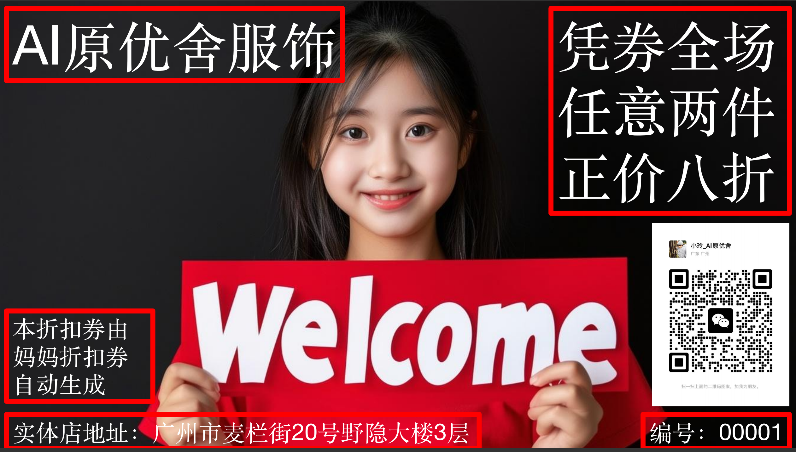
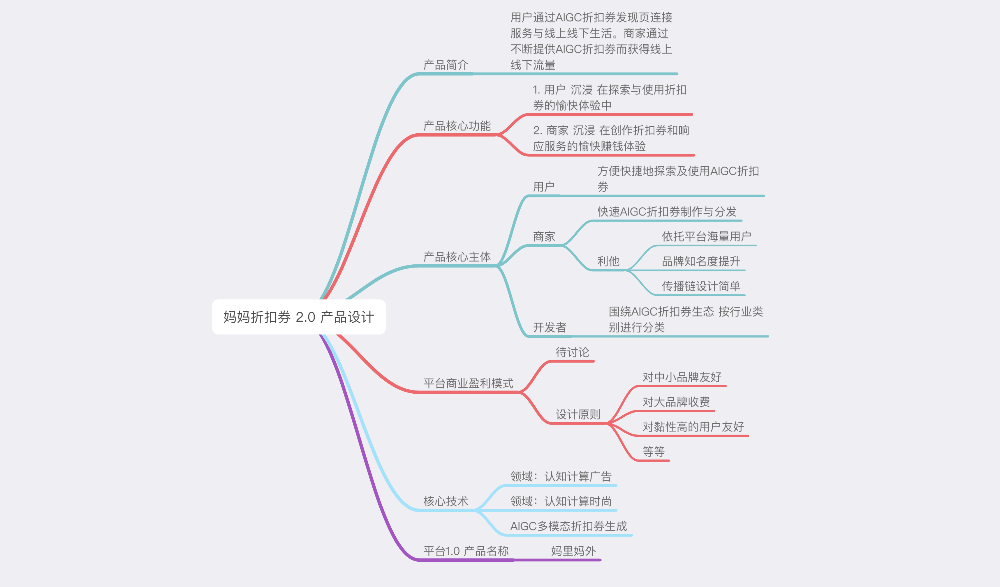

# 妈妈折扣券 2.0
## 2024年中国消费者趋势
1. 消费者信心依然低迷，但消费复苏的积极信号正在显现
2. 低线城市年轻群体的消费信心依然充足
3. 消费支出的重点逐步转向服务和体验
4. 消费观念至关重要

## 简介
* 产品名称：妈妈折扣券
* 所属行业：Cognitive Computational Advertising & Cognitive Computational Fashion

## 核心功能
1. 让 消费者 沉浸 在探索与使用折扣券的愉快体验中
2. 让 商家 沉浸 在创作折扣券和响应服务的愉快赚钱体验

## 成功案例

* AI原优舍借助妈妈折扣券实现业绩200%的增长

## 产品设计思维导图

## 技术选型
1. FastAPI for the Python backend API.
2. SQLModel for the Python SQL database interactions (ORM).
3. Pydantic, used by FastAPI, for the data validation and settings management.
4. MySQL as the SQL database.
5. Vue for the frontend.
  - Using TypeScript, hooks, Vite, and other parts of a modern frontend stack.
  - Chakra UI for the frontend components.
  - An automatically generated frontend client.
  - Dark mode support.
  - Docker Compose for development and production.
  - Secure password hashing by default.
  - JWT token authentication.
  - Email based password recovery.
6. Tests with Pytest.
7. Nginx / Traefik as a reverse proxy / load balancer.
8. Deployment instructions using Docker Compose, including how to set up a frontend Traefik proxy to handle automatic HTTPS certificates.
9. CI (continuous integration) and CD (continuous deployment) based on GitHub Actions.

## 主创团队
* Wei Jiang, wei@suanfamama.com
* Mama Xiao, mama.xiao@suanfamama.com

## 算法妈妈

* 公司官网：https://www.suanfamama.com/
